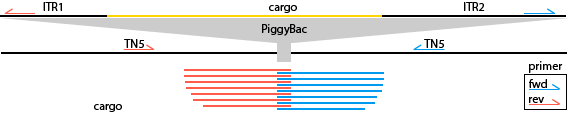
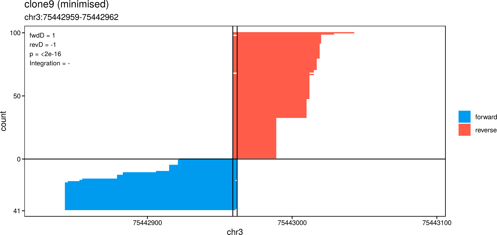
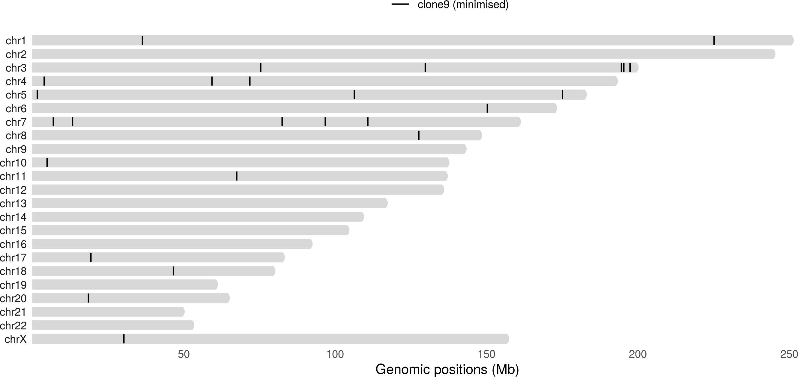

<!-- README.md is generated from README.Rmd. Please edit that file -->

# tagMeppr 


[](https://travis-ci.org/robinweide/tagmeppr)
[](https://www.repostatus.org/#wip)
[](https://cran.r-project.org/)

*A computational pipeline to map TagMap-reads*

TagMap is a very useful method for transposon mapping (Stern 2017),
enabling researchers to map the insertion sites with ease and generate
long sequencing reads. However, there is little to none automatisation
and downstream analysis software available for these reads. TagMeppr is
an easy to use, memory efficient fastq-to-figure package written in R.



## Installation

``` r
# Install development version from GitHub
devtools::install_github("robinweide/tagmeppr")
```
## The method
The `findInsertions()` function will first find all reads that overlap a TIS, 
which in the case of PiggyBac will be "TTAA". Next it will calculate whether 
there is a bias towards one side of the TIS using a binominal test. The bias, 
denoted as $D$, $-1$ when all reads are upstream and $+1$ when all reads are 
downstream of the TIS.This is done independently for the forward and reverse 
reads:

$p_{fwd/rev} = \binom{reads_{D<0}}{reads}$

Next, we filter out TISs which have the bias on the same side of the TIS:

$sgn(D_{fwd}) \neq sgn(D_{rev})$

To calculate a "TIS-specific" p-value, we use Edgington's sum-p method, which 
is very conservative in our usage. This ensures that, when 
$p_{combined} < \alpha$, both the fwd and the rev reads are indeed biased.

$p_{combined} = \dfrac{(\sum_{i=1}^{2} p_i)^{2}}{2!}$

Afterwards, a holm-correction is done to limit the Family-Wise Error Rate (FWER).

## Usage

The basic usage of tagMapper revolves around three clear steps:

1.  index: a tagMapper-index is made once for a specific genome and
    protocol (e.g. hg19 and PigyBac).
2.  align: a tagMapperSample-object is made and aligned to the index
3.  analyse: determine and plot highly likely integraton-sites

Within the analyse-step, you can shoose to look at individual found
insertion- sites with `plotSite()` to check the read-distribution. Here,
reads from the forward and reverse primers overlapping the Target
Insertion Site (TIS) are sorted. This can be helpfull for
quality-checking and determining if the protocol behaves as expected. In
the top-right corner is some important information about the selected
hit: the two `D-scores` (denoting the bias of up- and downstream mapping
of forward and reverse reads) and the
probability.



You can also look at all found sites in one ideogram with
`plotInsertions()`, subsetted on the orientation of the insertion and/or
multiple
samples.



See the
[vignette](https://raw.githubusercontent.com/robinweide/tagmeppr/master/vignettes/tagmeppr.pdf)
for a more in-depth coverage of all things tagMeppr\!

## Code of conduct

Please note that this project is released with a [Contributor Code of
Conduct](.github/CODE_OF_CONDUCT.md). By participating in this project
you agree to abide by its terms.

-----

<div id="refs" class="references">

<div id="ref-Stern037762">

Stern, David L. 2017. “Tagmentation-Based Mapping (Tagmap) of Mobile Dna
Genomic Insertion Sites.” *bioRxiv*. Cold Spring Harbor Laboratory.
<https://doi.org/10.1101/037762>.

</div>

</div>
